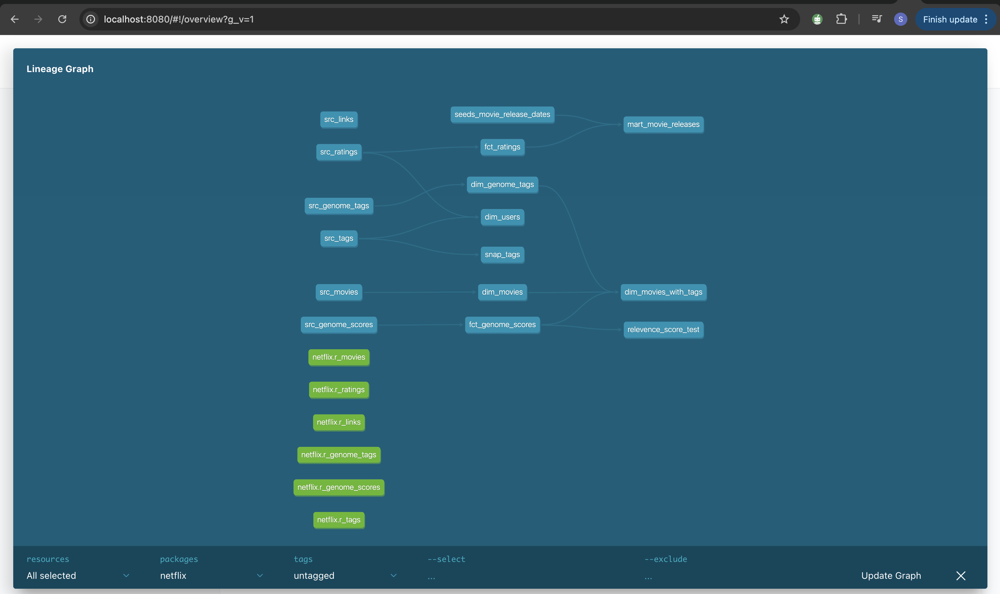
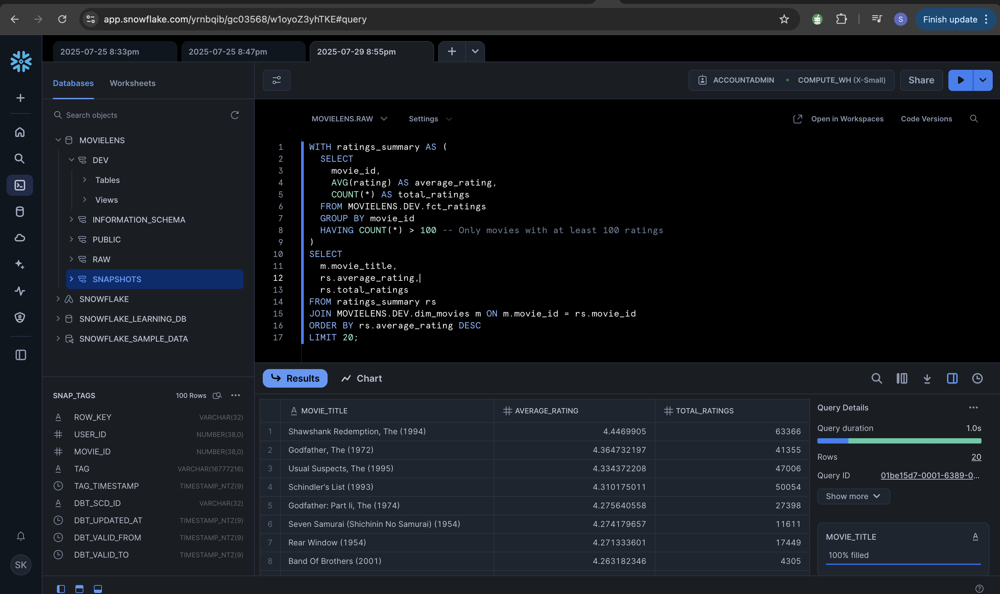

# Netflix Movie Recommendation System - dbt ELT Pipeline


##  Project Overview

This project implements a modern data pipeline using **dbt (Data Build Tool)** to transform and model movie recommendation data from the MovieLens dataset. The pipeline transforms movie ratings, genome scores, tags, and metadata to create a comprehensive analytics-ready data warehouse in **Snowflake**.

##  Architecture

The project follows a **medallion architecture** with the following layers:

- **Raw Layer**: Source data from MovieLens dataset
- **Staging Layer**: Basic transformations and data cleaning
- **Dimensional Layer**: Star schema with dimension and fact tables
- **Mart Layer**: Business-specific aggregated models

### Technology Stack
- **Data Warehouse**: Snowflake for analytics workloads
- **Transformation**: dbt for ELT transformations
- **Testing**: dbt tests for data quality validation

##  Data Lineage



*The above diagram shows the complete data lineage and dependencies between models in our dbt project.*

##  Analytics Capabilities



*Example of complex analytical queries running on our transformed data in Snowflake.*

##  Project Structure

```
netflix/                   # dbt project
├── dbt_project.yml        # Project configuration
├── packages.yml           # dbt package dependencies
├── models/
│   ├── staging/           # Source data transformations
│   │   ├── src_movies.sql
│   │   ├── src_ratings.sql
│   │   ├── src_tags.sql
│   │   ├── src_genome_scores.sql
│   │   ├── src_genome_tags.sql
│   │   └── src_links.sql
│   ├── dim/               # Dimension tables
│   │   ├── dim_movies.sql
│   │   ├── dim_users.sql
│   │   ├── dim_genome_tags.sql
│   │   └── dim_movies_with_tags.sql
│   ├── fct/               # Fact tables
│   │   ├── fct_ratings.sql
│   │   └── fct_genome_scores.sql
│   ├── mart/              # Business aggregations
│   │   └── mart_movie_releases.sql
│   ├── sources.yaml       # Source definitions
│   └── schema.yml         # Model tests and documentation
├── macros/
│   └── no_nulls_in_columns.sql
├── tests/
│   └── relevence_score_test.sql
├── seeds/
│   └── seeds_movie_release_dates.csv
├── snapshots/
│   └── snap_tags.sql      # SCD Type 2 for tags
└── analyses/
    └── analysis.sql
```

##  Models Description

### Staging Models
- **src_movies**: Clean movie metadata with genres and release information
- **src_ratings**: User ratings with timestamps
- **src_tags**: User-generated tags for movies
- **src_genome_scores**: ML-generated relevance scores for movie-tag combinations
- **src_genome_tags**: Tag definitions and descriptions
- **src_links**: External links (IMDb, TMDb)

### Dimension Models
- **dim_movies**: Movie master data with cleaned titles and genres
- **dim_users**: User demographics and behavior patterns
- **dim_genome_tags**: Tag taxonomy and definitions
- **dim_movies_with_tags**: Movies enriched with tag information

### Fact Models
- **fct_ratings**: Central fact table for user ratings
- **fct_genome_scores**: ML-based movie-tag relevance scores

### Mart Models
- **mart_movie_releases**: Aggregated movie release patterns and trends

## 🛠️ Setup Instructions

### Prerequisites
- **Python** 3.8+
- **dbt-core** and **dbt-snowflake** adapter
- **Snowflake account** with appropriate permissions

### Installation

1. **Clone the repository**
   ```bash
   git clone <repository-url>
   cd netflix-dbt
   ```

2. **Create virtual environment**
   ```bash
   python -m venv venv
   source venv/bin/activate  # On Windows: venv\Scripts\activate
   ```

3. **Install dependencies**
   ```bash
   pip install dbt-core dbt-snowflake
   ```

4. **Install dbt packages**
   ```bash
   cd netflix
   dbt deps
   ```

5. **Configure profiles.yml**
   Create/update `~/.dbt/profiles.yml`:
   ```yaml
   netflix:
     target: dev
     outputs:
       dev:
         type: snowflake
         account: <your-account>
         user: <your-username>
         password: <your-password>
         role: <your-role>
         database: <your-database>
         warehouse: <your-warehouse>
         schema: <your-schema>
         threads: 4
   ```

## 🚀 Running the Project

### Core Commands

```bash
# Install dependencies
dbt deps

# Run all models
dbt run

# Run tests
dbt test

# Generate documentation
dbt docs generate

# Serve documentation locally
dbt docs serve

# Run specific models
dbt run --select staging
dbt run --select dim_movies+

# Run with full refresh
dbt run --full-refresh

# Run snapshots
dbt snapshot
```

### Development Workflow

1. **Build staging models first**
   ```bash
   dbt run --select staging
   ```

2. **Build dimension tables**
   ```bash
   dbt run --select dim
   ```

3. **Build fact tables**
   ```bash
   dbt run --select fct
   ```

4. **Build mart tables**
   ```bash
   dbt run --select mart
   ```

5. **Run all tests**
   ```bash
   dbt test
   ```


